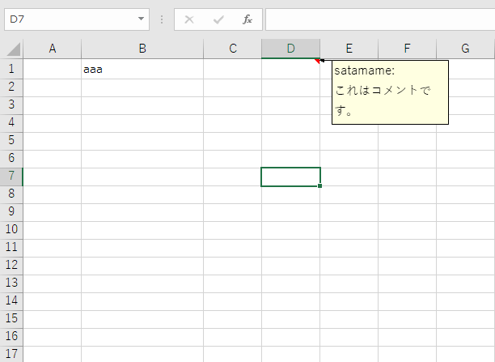
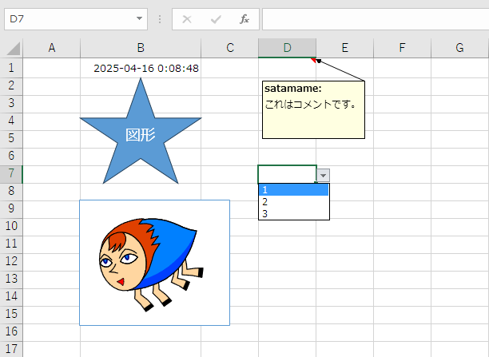

# Restore drawings in WB saved with openpyxl

[⇒ 日本語版](https://github.com/satamame/openpyxl-save-drawings/blob/main/README_ja.md)

Saving a workbook with [openpyxl](https://openpyxl.readthedocs.io/) has the limitation that drawings are not saved.
If you open an existing Excel book as [Workbook](https://openpyxl.readthedocs.io/en/stable/api/openpyxl.workbook.workbook.html), change the cell values and save over, you will lose the drawings.

## Solution overview

Unzip the pre-save and post-save Excel books into temporary folders respectively.  
Restore the data from the pre-save book and finally zip the post-save folder.

This solution restores the following.

1. drawings and images
2. comment style
3. data entry rules

*Some items may not be restored.

## Demonstration.

Steps to view the demo on Windows.

### Save as is with openpyxl

1. Clone this repository and create venv using requirements.txt.
    ```
    > python -m venv .venv --upgrade-deps.
    > .venv/Scrips/activate
    (.venv)> pip install -r requirements.txt
    ```
1. To open a.xlsx with openpyxl and save it as b.xlsx:
    ```
    (.venv)> python app.py a.xlsx b.xlsx --just-save
    ```
    a.xlsx (before saving)  
    

    b.xlsx (after saving)  
    

### Save with the solution

1. To open a.xlsx in openpyxl, make changes, save and restore the image:
    ```
    (.venv)> python app.py a.xlsx b.xlsx
    ```
    b.xlsx (Change cell B1 value, save and restore drawings)  
    

## Usage

You can copy the module save_with_drawings.py into a project using openpyxl.

```python
from pathlib import Path
from openpyxl import load_workbook
from save_with_drawings import save_with_drawings

src = Path('a.xlsx')
wb = load_workbook(src)

# Make some changes here.

dest = Path('b.xlsx')
temp_dir_args = {'prefix': 'temp_', 'dir': '.'}

save_with_drawings(wb, src, dest, temp_dir_args)
```

\* See docstring in source code for `save_with_drawings()` arguments.
